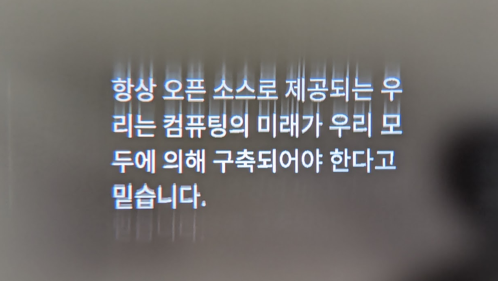
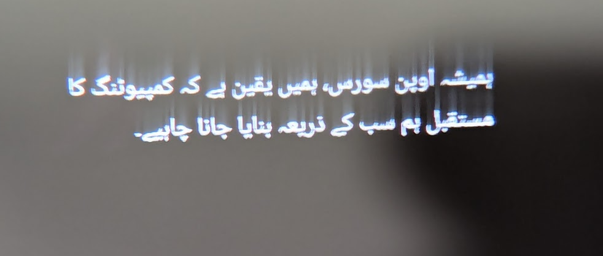
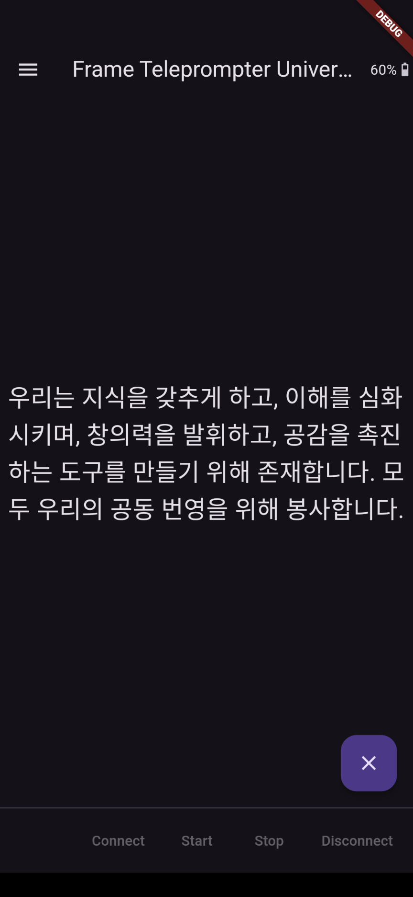
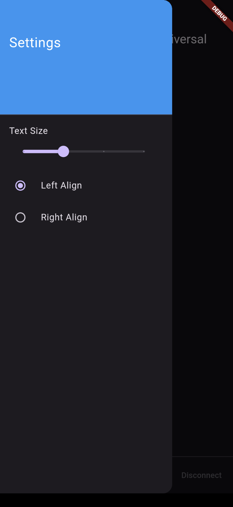

# Teleprompter for Frame with Unicode Support

Simple teleprompter that loads a UTF-8 text file picked from the user's device and sends one line at a time for display on Frame. (If only ASCII/Latin text is required, consider the [non-Unicode plaintext teleprompter](https://github.com/CitizenOneX/frame_teleprompter).)

Next/Previous paging through content is done via a vertical swipe up or down anywhere on the application screen.

As a result, bluetooth page-turning (and "TikTok scrolling") rings can be used for paging forward and backward, since they (some of them, at least) connect to the phone as a HID device imitating a mouse, and perform a click and drag up/down over a certain region of the display.

For a sample text file, [mission_korean.txt](assets/mission_korean.txt) (Korean/English, left-to-right) and [mission_urdu.txt](assets/mission_urdu.txt) (Urdu, right-to-left) are provided in this repo, although they aren't used at runtime by Flutter. Instead, you can download these files to your device Downloads folder and pick them when running the app (or any other UFT-8 .txt file of your choosing).

### Features

* Adjustable text size (16, 32, 48, 64)
* Left-align, Right-align text (suitable for left-to-right and right-to-left languages, respectively.)

### Known issues

* Pagination is only performed based on line breaks in the provided text file. If you want to change how much text appears on each page of the teleprompter, edit your .txt file.
* Automatic scrolling (line or page) is not supported. Manual next/prev with a cheap TikTok bluetooth ring might be a good/better solution in some cases.
* Transferring text rasterized to sprites is slower (a few seconds per line?) than plain text in the original frame_teleprompter (effectively instant). Smaller font sizes are faster, and there may be future improvements to text sprite transfer speed.
* Drawing too much text (more than fits on the display) seems to result in visual glitches. This might be fixed in future firmware or app code. Smaller font sizes or adjusting text file line breaks can prevent this.
* Left/Right align works best with left-to-right and right-to-left text respectively, and the one setting effectively controls both at the same time. Issues arise with left-to-right text aligned to the right, for example punctuation characters might move to the other side.
* Blank lines in the .txt file do not clear the display correctly - might be fixed in a future firmware or app release. Empty lines should be removed from the input .txt file.
* Changing text sizes, alignment or moving through pages before the prior page has drawn fully can lead to issues. Cancel/Stop/Start will fix most; out-of-memory will require a Stop/Disconnect/Connect/Start.

### Frameshots

### Screenshots

### Architecture
